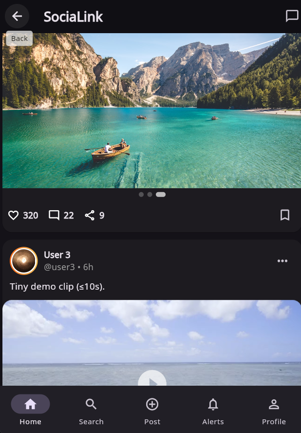

# Flutter Social Media App

[](https://flutter.dev)
[](https://dart.dev)
[](LICENSE)
[](https://flutter.dev)

A modern, minimal social media application built with **Flutter**, **Riverpod**, and **Supabase**.  
Includes email/password authentication, profiles, feed scaffolding, search, and real-time chat groundwork.

---

## 📱 Screenshots

<p align="center">
  
  
</p>
<p align="center">
  
  
</p>

---


## ✨ Features

- 🔐 **Auth**: Email & password (Supabase), optional email confirmation
- 👤 **Profiles**: `profiles` table with RLS (username, full name, avatar)
- 🧵 **Feed**: Post + actions scaffolding (likes/comments structure)
- 🔎 **Search**: User/post search skeleton
- 💬 **Chat**: Real-time chat service & state foundations
- 🔔 **Notifications**: Repository scaffold
- 🧭 **Auth Gate**: Session-based routing (Login/Register ↔ App)

---

## 🧱 Tech Stack

- Flutter **3.x**, Dart **3.x**
- **Riverpod** (state management)
- **Supabase** (Auth, Postgres, RLS, Realtime)
- (Optional) **Firebase Core** & **Google Fonts** for theming demo

---

## 🗂️ Project Structure

lib/
├─ main.dart # ProviderScope + Supabase init + MaterialApp
├─ index.dart # HomeShell (app shell)
├─ features/
│ ├─ auth/
│ │ ├─ auth_gate.dart # Session-based guard
│ │ ├─ login.dart
│ │ └─ register.dart
│ ├─ profile/
│ │ └─ profile_page.dart
│ ├─ search/
│ │ └─ search_page.dart
│ └─ stories/ # (placeholder / WIP)
├─ models/
│ ├─ conversation.dart
│ ├─ message.dart
│ ├─ post.dart
│ ├─ profile_brief.dart
│ └─ user.dart
├─ services/
│ ├─ auth_service.dart
│ ├─ chat_service.dart
│ ├─ comments_repo.dart
│ ├─ follow_repo.dart
│ ├─ notifications_repo.dart
│ ├─ post_actions.dart
│ ├─ post_repo.dart
│ ├─ supabase_service.dart
│ └─ webrtc_share_service.dart
└─ state/
├─ auth_controller.dart
├─ auth_state.dart
├─ chat_controller.dart
├─ chat_state.dart
├─ feed_controller.dart
└─ follow_controller.dart

---

## 🚀 Getting Started

### 1) Prerequisites
- Flutter **3.x** / Dart **3.x**
- A **Supabase** project → https://supabase.com
- (Optional) iOS/Android toolchains for mobile targets

### 2) Clone & install
```bash
git clone https://github.com/sebahattinn/Flutter_SocialMedia.git
cd Flutter_SocialMedia
flutter pub get


3) Configure Supabase

Create a project; copy Project URL and anon key.

Auth → Providers → Email

For fast local dev: Confirm email = OFF (you can switch ON for prod).

Database → SQL → run:


-- profiles table
create table if not exists public.profiles (
  id uuid primary key references auth.users(id) on delete cascade,
  username text unique,
  full_name text,
  avatar_url text,
  created_at timestamp with time zone default now()
);

alter table public.profiles enable row level security;

-- RLS policies
create policy "read own profile"
on public.profiles for select
using (auth.uid() = id);

create policy "insert own profile"
on public.profiles for insert
with check (auth.uid() = id);

create policy "update own profile"
on public.profiles for update
using (auth.uid() = id);


Production-friendly (optional): Create the profile automatically on user creation using a trigger (so client doesn’t upsert when session is null):


create or replace function public.handle_new_user()
returns trigger as $$
begin
  insert into public.profiles (id, username, full_name)
  values (
    new.id,
    coalesce(new.raw_user_meta_data->>'username',''),
    coalesce(new.raw_user_meta_data->>'full_name','')
  );
  return new;
end;
$$ language plpgsql security definer;

drop trigger if exists on_auth_user_created on auth.users;
create trigger on_auth_user_created
after insert on auth.users
for each row execute function public.handle_new_user();

4) Web redirect configuration (when Confirm email = ON)

Authentication → URL Configuration

Site URL: your local origin, e.g. http://localhost:5173

Additional Redirect URLs: add
http://localhost:5173, http://127.0.0.1:5173

Run Flutter Web with a fixed port so redirects always match:


flutter run -d chrome --web-port=5173


5) App config (env)

supabase_service.dart reads credentials from --dart-define:

// services/supabase_service.dart (excerpt)
static const String _url  = String.fromEnvironment('SUPABASE_URL');
static const String _anon = String.fromEnvironment('SUPABASE_ANON_KEY');


Run with:

# Web (fixed port)
flutter run -d chrome --web-port=5173 \
  --dart-define=SUPABASE_URL=https://YOUR-PROJECT.supabase.co \
  --dart-define=SUPABASE_ANON_KEY=YOUR-ANON-KEY

# Mobile (Android/iOS)
flutter run \
  --dart-define=SUPABASE_URL=https://YOUR-PROJECT.supabase.co \
  --dart-define=SUPABASE_ANON_KEY=YOUR-ANON-KEY

🔐 Auth Flow Notes

Confirm email OFF (dev): signUp returns a session immediately → app enters via AuthGate.

Confirm email ON (prod): signUp creates the user but no session until email is confirmed.
Make sure redirect URLs match your running origin so the token is captured and session established.

🧩 Troubleshooting

Duplicate mapping key in pubspec.yaml
A dependency (e.g., supabase_flutter) is listed twice. Remove duplicates, fix indentation, flutter pub get.

Invalid login credentials
Often the email isn’t confirmed (when confirmation is ON). Confirm email first or disable confirmation for dev.

“For security purposes, you can only request this after XX seconds.”
Supabase throttles resend/requests (~60s). Wait a minute or try a different email.

RLS/401 when writing profiles
Don’t upsert when session is null (before confirmation), or move profile creation into the DB trigger above.

Web confirm redirects don’t log in
Use a fixed port (e.g., --web-port=5173) and add that origin to Supabase URL Configuration.

Riverpod error: ref.listen can only be used within the build method
Use ref.listen inside build, or ref.listenManual in initState and remember to close the subscription.

🗺️ Roadmap

 Real-time chat UI + typing indicators

 Media uploads (images/videos) + storage rules

 Reels/Stories module

 Push notifications

 Moderation tools & Admin Panel

 Theming, localization, accessibility polish

🤝 Contributing

PRs are welcome!

Create a feature branch

Keep commits small and meaningful

Update docs where needed

📄 License

This project is licensed under the MIT License. See LICENSE
.

🙌 Credits

Built with ❤️ using Flutter, Riverpod, and Supabase.
Repo: https://github.com/sebahattinn/Flutter_SocialMedia


